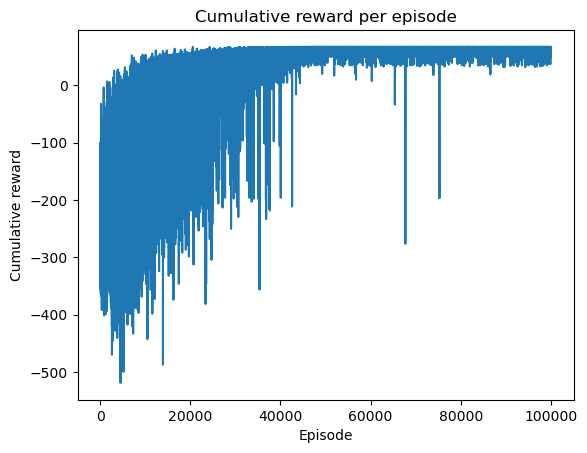
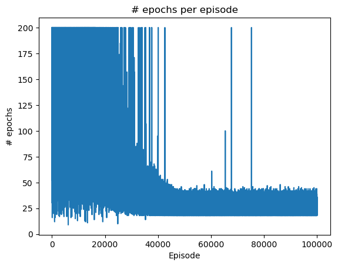

Dungeon Crawler RL

    This project is a custom Reinforcement Learning environment of a dungeon crawler game. The agent learns to navigate a dungeon while avoiding lava pits, collect loot, defeat bosses, and save the princess. Using Gymnasium and Pygame, the environment is built to simulate the game dynamics. Unlike standard grid worlds which typically involve simple navigation (Point A to Point B), this environment introduces state dependencies and combat logic. 

Environment Design

- The Map

````
```
MAP = [
    "+-------------+",
    "|M: : : : :B|F|",
    "| : : : : : : |",
    "|M: |-:-: : |B|",
    "|R:B| : : :-| |",
    "|-:-| : :M: :B|",
    "| : : :-:-: :-|",
    "|P: : : :R:M:L|",
    "+-------------+",
]
```
````
    The environment is built on a 7x7 grid containing:
    •	Walls (|, -): Impassable barriers defining the ground layout.
    •	Restricted Areas (R): "Lava" tiles.
    •	Entities:
        o	Player (P): The learning agent.
        o	Loot (L): A weapon required to damage the main boss.
        o	Mini-Boss (M): An enemy that grants a damage power-up.
        o	Main Boss (B): The primary antagonist blocking the victory condition.
        o   Restricted Area (R): "Lava" tiles that the player cannot pass.
        o	Finish Line (F): The exit point where the princess is waiting to get rescued.
         
State  
  The game has 25,088 possible states .The logic behind it:
    •	Player Position: 49 possible positions (7x7 grid).
    •	Health levels : 4 possible health levels (0, 1, 2, 3).
    •	Mini-Boss Position: 4 possible positions .
    •	Main Boss Position: 4 possible positions .
    •   Loot Status: 2 possible states (collected or not).
    •   Mini-Boss Status: 2 possible states (alive or dead).
    •   Main Boss Status: 2 possible states (alive or dead).
so the total number of states is 49 * 4 * 4 * 4 * 2 * 2 * 2 = 25,088


  

- Reward system:
    The reward system is as follows:
    - -1 for each time step taken
    - +10 for collecting the loot
    - +10 for defeating the mini-boss
    - +20 for defeating the main boss
    - +30 for saving the princess
    - -2 for wasted attack
    - -15 for fighting any boss without the needed requirements 
    - -20 for going to save the proncess without killing the boss
    - -20 for dying 
    - shaping reward: this is a function that gives a reward based on the player's position and pushes it towards the objective.Without this function my code was spairling for hours.   
        o	+0.5  for each step taken to reach the finish line
        o	-0.6 for each step taken away from the finish line

- Actions:
  There are 5 actions:
    0: move south
    1: move north
    2: move east
    3: move west
    4: attack

- Game's Logic:
    •	Movement: The player can move in four directions (south, north, east, west) if the target tile is not a wall.
    •	Attacking: The player can attack any enemy (mini-boss, main boss) if they are in the same tile.However to have a succesfull attack the player needs to follow a certain order; fist they need to get the loot which is a weapon that later will help them defeat the mini boss. Only after defeating the mini boss and get the reward can the player defeat main boos.
    if the player tries to attack the mini-boss without getting the loot first they will get punished with a penalty of -15.Same thing if the player tries to attack the main boss without getting the mini-boss first.(Loot --> Mini-Boss --> Main Boss --> Finish)

    •	Health Management:
        o	If the player attacks the main boss or the mini boss without the required power-ups , they lose 2 health points.
        o	If the player's health drops to 0, they die, and the episode ends.

    - Finishing the game:
    o	If the player reaches the finish line (save the princess) before defeating the main boss, they get a penalty of 20 points.
    o	If the player reaches the finish line (save the princess) after defeating the main boss, they get a reward of 30 points.    

- Hyperparameters:
    o Alpha (Learning Rate): 0.1
    o Gamma (Discount Factor): 1.0
    o Epsilon (Exploration Rate): 0.05
    o Number of Episodes: 100,000
    o Max Steps per Episode: 200
    alpha = 0.1

- Q-Learning algorithm:
  The project implements the Q-Learning algorithm to train the player. The algorithm updates the Q-values based on the rewards received and the player's actions. The Q-Table is saved to a CSV file for future use without re-training.

- Evaluation: 
  The agent is evaluated every 300 episodes during training. Then, tracks and saves the best model based on cumulative reward. Finally, it plots the cumulative reward over time and the loss over time.
  
How to run:
1. Open the Jupyter Notebook game.ipynb.
2. Run the cells containing the GameEnv class definition and the visualization methods.
3. Run the Training cell.
   o This will train the agent for 100,000 episodes.
   o It will automatically save the best Q-Table to q_table_best.csv.
4. Test policy performance after training:
   o Run the Testing cell.
   o This will load the Q-Table from q_table_best.csv and run the agent in the environment.
   o It will display the final reward and a visualization of the agent's path.

- Results:

  


  

The training process was conducted over 100,000 episodes. The results show that the agent was successfully trained to navigate the environment, achieving its best cumulative reward of 66.9 at Episode 20575.